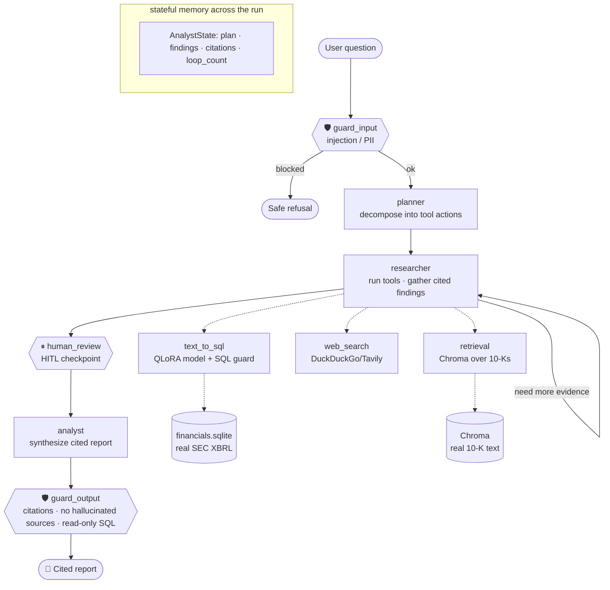

# 🔎 Multi-Agent Financial Analyst

**▶️ Live demo:** **https://huggingface.co/spaces/abhiram3000/multi-agent-analyst**

**An autonomous multi-agent analyst with a self-fine-tuned SQL tool, guardrails, and RAGAS evals.** Ask a question about real public companies and a LangGraph agent *plans*, calls tools (10-K retrieval · web search · a **QLoRA-fine-tuned Text-to-SQL model**), passes input/output **guardrails**, pauses at a **human-in-the-loop checkpoint**, and produces a **cited analytical report** — every run scored by a **RAGAS/DeepEval** harness and traceable in LangSmith.

> Not a RAG chatbot: it *does* something — decomposes a task, routes to the right tool, synthesizes a sourced artifact, and evaluates itself. All data is **real** (SEC EDGAR financials + 10-K filings; Spider for the fine-tune).

---

## 🎥 Demo

**Live on Hugging Face Spaces (Gradio):** https://huggingface.co/spaces/abhiram3000/multi-agent-analyst

- The **Analyst** tab streams the agent's reasoning + tool calls live, then shows the cited report. The **Evals** tab shows the latest scorecard.
- Deploy your own: [DEPLOY.md](DEPLOY.md).

```
Q: "Which company had the highest revenue last year, and what are its main risks?"
[planner] step 1: find highest-revenue company (text_to_sql)
[planner] step 2: retrieve its risk factors (retrieval)
[researcher] text_to_sql -> Walmart $706,413M  (provenance: finetuned-adapter)
[researcher] retrieval -> 4 chunks from wmt_10k.md
[checkpoint] awaiting human approval before the report …
[analyst] cited report citing [SQL], [wmt_10k.md]
```

> Tool provenance: on a **GPU/ZeroGPU** Space the SQL tool loads the QLoRA adapter (`finetuned-adapter`); on the **free CPU** Space it transparently falls back to Groq (`groq-fallback`). Either way the SQL is read-only, guarded, and executed against the real DB.

---

## 🏗️ Architecture



State persists across nodes via a typed `AnalystState` + a LangGraph `MemorySaver` checkpointer (which is what makes the HITL pause/resume possible).

---

## 📊 Proof points

### 1. QLoRA Text-to-SQL — execution accuracy, before vs after

QLoRA fine-tune (4-bit base, LoRA r=16/α=32/all-linear) of a Text-to-SQL model, scored by **execution accuracy** (run the SQL against the real databases, compare result sets — not BLEU). Adapter: [`abhiram3000/llama31-sql-qlora`](https://huggingface.co/abhiram3000/llama31-sql-qlora). See [finetune/](finetune/).

Measured on **200 held-out Spider dev** questions (generate SQL → execute → compare result sets to gold):

| Model | Exec accuracy | Runnable rate |
|---|---|---|
| Base Llama-3.1-8B-Instruct (4-bit) | 49.0% | 77.5% |
| **+ QLoRA (Spider)** | **54.5%** | **81.0%** |
| **Δ** | **+5.5 pts** (+11% rel.) | **+3.5 pts** |

> Reproduce with the in-notebook eval in [`finetune/train_qlora.ipynb`](finetune/train_qlora.ipynb) (writes `eval_report.json`).

### 2. RAGAS / DeepEval scorecard (real, on the golden set)

8 golden questions grounded in the real DB + 10-Ks. Judge = Groq; embeddings = ONNX MiniLM. (Numbers below from `llama-3.1-8b-instant`; the 70B model scores higher.)

| RAGAS | Score | Thr | | DeepEval (G-Eval) | Score |
|---|---|---|---|---|---|
| faithfulness | 0.625 | 0.80 | | Citation Correctness | 0.96 |
| answer relevancy | 0.675 | 0.75 | | Analytical Depth | 0.68 |
| context precision | 0.588 | 0.70 | | | |
| context recall | 0.588 | 0.70 | | | |

Regenerate: `python -m src.eval.ragas_eval` · `python -m src.eval.deepeval_eval` (scorecards in [eval_results/](eval_results/), shown in the app's Evals tab).

---

## 🚀 Quickstart

```bash
git clone https://github.com/Abhi241-bot/Datascience2
cd Datascience2
python -m venv .venv && .venv\Scripts\activate    # macOS/Linux: source .venv/bin/activate
pip install -r requirements.txt

cp .env.example .env        # add GROQ_API_KEY (free: https://console.groq.com/keys)
python data/fetch_sec_data.py   # fetch real SEC financials + 10-K text (one time)
python app.py               # open http://127.0.0.1:7860
```

- **Fine-tune the SQL tool:** [`finetune/train_qlora.ipynb`](finetune/train_qlora.ipynb) (Colab T4) → set `SQL_ADAPTER_REPO` in `.env`.
- **Run evals:** `pip install -r requirements-dev.txt` then `python -m src.eval.ragas_eval`.
- **Deploy:** [DEPLOY.md](DEPLOY.md) (free HF Spaces).
- **Tests:** `pytest` (offline tests need no key; live tests skip without `GROQ_API_KEY`).

---

## 🧰 Stack & components

| Layer | Tool |
|---|---|
| Orchestration | **LangGraph** (stateful multi-agent graph + HITL) |
| Orchestrator LLM | **Groq** (`llama-3.1-8b-instant`, free) |
| Fine-tune | **Unsloth + PEFT + BitsAndBytes** (QLoRA) on **Spider** → [`abhiram3000/llama31-sql-qlora`](https://huggingface.co/abhiram3000/llama31-sql-qlora) |
| Retrieval | **Chroma** + ONNX MiniLM embeddings (no API key) |
| Evals | **RAGAS** + **DeepEval** (G-Eval) + **LangSmith** traces |
| Guardrails | custom validators (injection · PII · read-only SQL · citations) |
| UI / deploy | **Gradio** → **Hugging Face Spaces** |

**Agents:** `planner` decomposes the question into tool actions · `researcher` runs the tools, gathers cited findings, and loops if evidence is thin · `analyst` writes the cited report.
**Tools:** `text_to_sql` (your fine-tuned model → read-only SQL → real financials DB) · `retrieval` (semantic search over real 10-Ks) · `web_search` (recent/external context).

Data: **SEC EDGAR** XBRL financials + 10-K excerpts for AAPL, MSFT, NVDA, JNJ, WMT, XOM (built by [`data/fetch_sec_data.py`](data/fetch_sec_data.py)).
